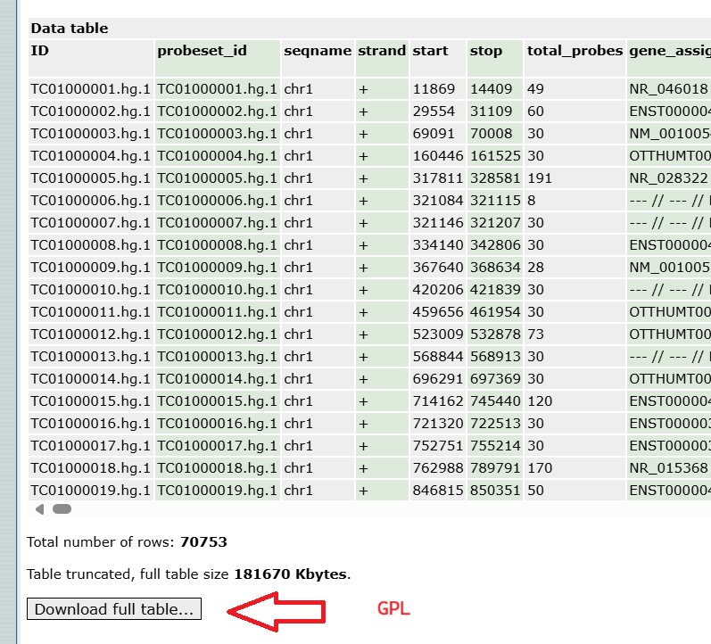
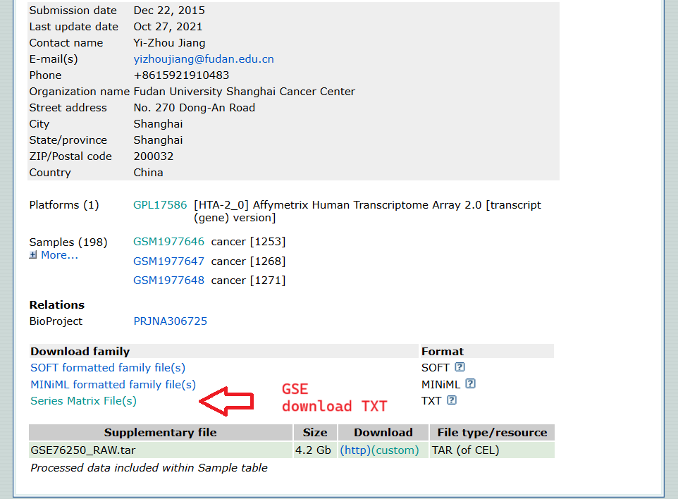

# Gene Expression Omnibus [GEO] data

Geo data is used in many research articles, for example s41598-025-87286-z, p. 3

## How to get GEO data?

Main site is https://www.ncbi.nlm.nih.gov/geo
The table below is from s41598-025-87286-z, p. 3

Datasets are based on GPL.
My view is that GPL is a kind of program or type of encoding.

Where the dataset has the values and a key,
the GPL has the metadata (ie. genome, like ERBB2)

You can click on the GEO datasets to go to the dataset.
In set GSE124648 and GSE10893 I couldn't differentiate what the TNBC samples are.
Also, for GPL16686 and GPL1390 I modified the URL to download as textfile:
https://www.ncbi.nlm.nih.gov/geo/query/acc.cgi?mode=raw&is_datatable=true&acc=GPL16686&id=17306&db=GeoDb_blob94
https://www.ncbi.nlm.nih.gov/geo/query/acc.cgi?mode=raw&is_datatable=true&acc=GPL1390&id=11300&db=GeoDb_blob92

Also, GSE61723, the GPL used does not show gene names, it refers to a website which does not show data.

With the four sets implemented, there are 302 TNBC and 77 nTNBC

| GEO datasets                                                              | GPL        | Upload year | Update year | TNBC sample size | Normal sample size |
| :--------:                                                                | :--------: | :---------: | :---------: | :--------------: | :----------------: |
| [GSE65216](https://www.ncbi.nlm.nih.gov/geo/query/acc.cgi?acc=GSE65216)   | [GPL570](https://www.ncbi.nlm.nih.gov/geo/query/acc.cgi?acc=GPL570)       | 2015        | 2019        | 55               | 11                 |
| [GSE76250](https://www.ncbi.nlm.nih.gov/geo/query/acc.cgi?acc=GSE76250)   | [GPL17586](https://www.ncbi.nlm.nih.gov/geo/query/acc.cgi?acc=GPL17586)   | 2015        | 2021        | 165              | 33                 |
| GSE61723                                                                  | GPL16686                                                                  | 2014        | 2021        | 33               | 17                 |
| GSE61724                                                                  | GPL6244                                                                   | 2014        | 2018        | 16               | 4                  |
| GSE81838                                                                  | GPL6244                                                                   | 2016        | 2018        | 10               | 10                 |
| GSE113865                                                                 | GPL10558                                                                  | 2018        | 2023        | 3                | 3                  |
| [GSE53752](https://www.ncbi.nlm.nih.gov/geo/query/acc.cgi?acc=GSE53752)   | [GPL7264](https://www.ncbi.nlm.nih.gov/geo/query/acc.cgi?acc=GPL7264)     | 2014        | 2014        | 51               | 25                 |
| GSE124648                                                                 | GPL96                                                                     | 2019        | 2019        | 108              | 10                 |
| [GSE10893](https://www.ncbi.nlm.nih.gov/geo/query/acc.cgi?acc=GSE10893)   | [GPL1390](https://www.ncbi.nlm.nih.gov/geo/query/acc.cgi?acc=GPL1390)     | 2008        | 2017        | 31               | 8                  |

normalbreast = 8

'A2M'    ,'ABCA1' ,'ACKR1'  ,'ACSL3' ,'ADH1B'  ,'AHR'   ,'AK5'     ,'AKT2'   ,'AKT3'    ,'ALDH1A1',
'ALOX12B','AOC3'  ,'APOE'   ,'AR'    ,'ARID1B' ,'ASAH1' ,'ASPSCR1' ,'ASXL1'  ,'ASXL3'   ,'BCL9',
'BIRC3'  ,'BRD4'  ,'BTN3A1' ,'CANT1' ,'CCL4'   ,'CCNE1' ,'CD163'   ,'CD1A'   ,'CD1B'    ,'CD1D',
'CD1E'   ,'CD24'  ,'CD274'  ,'CD276' ,'CD44'   ,'CD68'  ,'CD79A'   ,'CD86'   ,'CD8A'    ,'CD8B',
'CDH1'   ,'CDH3'  ,'CDH5'   ,'CDK1'  ,'CDK2'   ,'CDK4'  ,'CDK6'    ,'CDKN1B' ,'CDKN2B'  ,'CEACAM7',
'CKB'    ,'CLEC3A','COL1A2' ,'CREBBP','CSF2RB' ,'CTSD'  ,'CX3CR1'  ,'CXCR2'  ,'CXCR4'   ,'CYP1A1',
'DCLK1'  ,'DDR2'  ,'DEFB132','DNAH7' ,'DOCK11' ,'EDNRB' ,'EPCAM'   ,'ERBB2'  ,'ESR1'    ,'ESR2',
'EZH2'   ,'FBXW7' ,'FCGR2B' ,'FGA'   ,'FGB'    ,'FGFR1' ,'FGFR4'   ,'FOXC1'  ,'FOXP3    ,'FYN',
'GAS1'   ,'GATA3' ,'GLDC'   ,'GNG11' ,'GNLY'   ,'GSTA2' ,'HSP90AA1','HSP90B1','HSPA5'   ,'IDO1',
'IFNG'   ,'IGF1'  ,'IL2RB'  ,'IL2RG' ,'IL6'    ,'INPP4B','JCHAIN'  ,'KIT'    ,'KMT2D'   ,'KRT18',
'KRT5'   ,'KRT6B' ,'LAMA2'  ,'LMNA'  ,'LPA'    ,'MAP2K4','MAP3K1'  ,'MDGA2'  ,'MDM2'    ,'MET',
'MTOR'   ,'MUC1'  ,'MUC16'  ,'MYB'   ,'NF1'    ,'NOTCH3','OBSCN'   ,'OGN'    ,'OLAH'    ,'P4HA3',
'PDE2A'  ,'PGF'   ,'PGF'    ,'PGR'   ,'PHLDA2' ,'PIK3CA','PIK3R1'  ,'PIP'    ,'PKN1'    ,'PMS1',
'POSTN'  ,'PRR4'  ,'PTEN'   ,'PTK6'  ,'PTPRH'  ,'RAD17' ,'RAD51C'  ,'RYR1'   ,'SDS'     ,'SERPINA9',
'SNAI1'  ,'SPTA1' ,'SRD5A2' ,'SREBF1','STAT1'  ,'STAT3' ,'TACSTD2' ,'TBC1D1' ,'TBC1D22B','TBC1D31',
'TBC1D7' ,'TFF1'  ,'TGFB2'  ,'TGFB3' ,'TH'     ,'THBD'  ,'TIGIT'   ,'TOP2A'  ,'TP53'    ,'TTN',
'TYMS'   ,'VAV3'  ,'VEGFA'  ,'VEGFB' ,'VEGFD'  ,'VTCN1' ,'VWF'     ,'WTAP'   ,'XBP1'    ,'XCL1',
'XCL2'   ,'YES1'  ,'YOD1'

A2M,ABCA1,ACKR1,ACSL3,ADH1B,AHR,AK5,AKT2,AKT3,ALDH1A1,ALOX12B,AOC3,APOE,AR,ARID1B,ASAH1,ASPSCR1,ASXL1,ASXL3,BCL9,BIRC3,BRD4,BTN3A1,CANT1,CCL4,CCNE1,CD163,CD1A,CD1B,CD1D,CD1E,CD24,CD274,CD276,CD44,CD68,CD79A,CD86,CD8A,CD8B,CDH1,CDH3,CDH5,CDK1,CDK2,CDK6,CDKN1B,CDKN2B,CKB,COL1A1,COL1A2,CREBBP,CSF2RB,CSMD3,CTSD,CX3CR1,CXCR2,CXCR4,CYP1A1,DCLK1,DDR2,DEFB132,DNAH7,DOCK11,EDNRB,EPCAM,ERBB2,ESR1,ESR2,EZH2,FBXW7,FCGR2B,FGB,FGFR1,FGFR2,FGFR4,FOXC1,FOXP3,FYN,GAS1,GATA3,GLDC,GNG11,GNLY,GSTA2,HSP90AA1,HSP90B1,HSPA5,IDO1,IFNG,IGF1,IL2RB,IL6,INPP4B,JCHAIN,KIT,KMT2D,KRT18,KRT6B,LAMA2,LMNA,LPA,MAP2K4,MAP3K1,MDGA2,MDM2,MET,MTOR,MUC1,MUC16,MYB,NF1,NOTCH3,OBSCN,OGN,OLAH,P4HA3,PDE2A,PGF,PGR,PHLDA2,PIK3CA,PIK3R1,PIP,PKN1,PMS1,POSTN,PRR4,PTEN,PTK6,PTPRH,RAD17,RAD51C,RB1,RYR1,SDS,SERPINA9,SNAI1,SPTA1,SRD5A2,SREBF1,STAT1,STAT3,TACSTD2,TAT,TBC1D22B,TBC1D31,TFF1,TGFB2,TGFB3,TH,THBD,TOP2A,TP53,TTN,TYMS,VAV3,VEGFA,VEGFB,VEGFD,VTCN1,VWF,WTAP,XBP1,XCL2,YES1

CD1A,CSF2RB,EPCAM,ERBB2,ESR1,
EZH2,FGB,FOXA1,FOXC1,GATA3,
LAMA2,LMNA,MDGA2,OBSCN,OGN,
PGR,SELL,SRC,TACSTD2,TBC1D22B,
TFF1,TGFB3,UBE2C,VTCN1,WTAP,
YES1,YOD1

'CD1A','CSF2RB','EPCAM','ERBB2','ESR1',
'EZH2','FGB','FOXA1','FOXC1','GATA3',
'LAMA2','LMNA','MDGA2','OBSCN','OGN',
'PGR','SELL','SRC','TACSTD2','TBC1D22B',
'TFF1','TGFB3','UBE2C','VTCN1','WTAP',
'YES1','YOD1'

A2M,ABCA1,ACKR1,ACSL3,ADH1B,AHR,AK5,AKT2,AKT3,ALOX12B,AOC3,APOE,AR,ARID1B,ASAH1,ASPSCR1,ASXL1,ASXL3,BCL9,BIRC3,BRD4,BTN3A1,CANT1,CCL4,CCNE1,CD1A,CD1B,CD1D,CD1E,CD24,CD274,CD276,CD44,CD68,CD79A,CD86,CD8A,CD8B,CDH1,CDH3,CDH5,CDK1,CDK2,CDK6,CDKN1B,CDKN2B,CKB,COL1A1,COL1A2,CREBBP,CSF2RB,CTSD,CX3CR1,CXCR2,CXCR4,CYP1A1,DCLK1,DDR2,DEFB132,DNAH7,DOCK11,DST,EDNRB,EPCAM,ERBB2,ESR1,ESR2,EZH2,FBXW7,FCGR2B,FGB,FGFR1,FGFR2,FGFR4,FOXC1,FOXP3,FYN,GAS1,GATA3,GLDC,GNG11,GNLY,GSTA2,HSP90AA1,HSP90B1,HSPA5,IFNG,IGF1,IL2RB,IL6,INPP4B,JCHAIN,KIT,KMT2D,KRT18,KRT6B,LAMA2,LMNA,LPA,MAP2K4,MAP3K1,MDGA2,MDM2,MET,MTOR,MUC1,MUC16,MYB,NF1,NOTCH3,OBSCN,OGN,OLAH,P4HA3,PCK1,PDE2A,PGF,PGR,PHLDA2,PIK3CA,PIK3R1,PIP,PKN1,PMS1,POSTN,PRR4,PTEN,PTK6,PTPRH,RAD17,RAD51C,RDH12,RYR1,SDS,SERPINA9,SNAI1,SPTA1,SRD5A2,SREBF1,STAT1,STAT3,TACSTD2,TAT,TBC1D22B,TBC1D31,TFF1,TGFB2,TGFB3,TH,THBD,TOP2A,TP53,TTN,TYMS,VAV3,VEGFA,VEGFB,VEGFD,VTCN1,VWF,WTAP,XBP1,XCL2,YES1