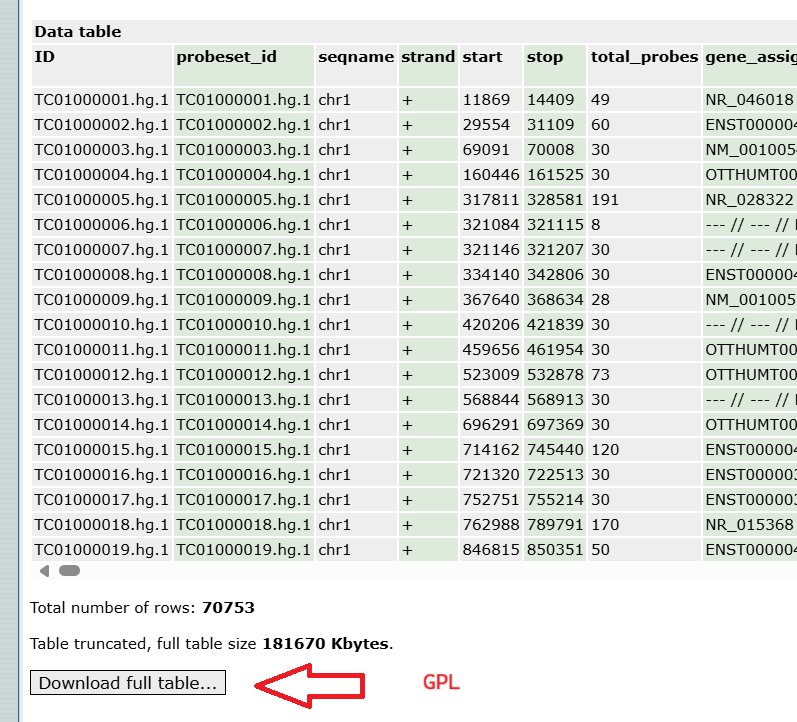
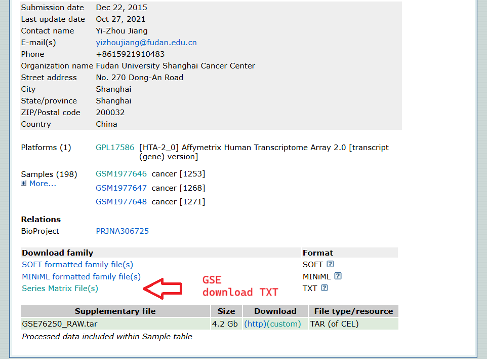

# Gene Expression Omnibus [GEO] data

Geo data is used in many research articles, for example s41598-025-87286-z, p. 3

## How to get GEO data?

Main site is https://www.ncbi.nlm.nih.gov/geo
The table below is from s41598-025-87286-z, p. 3

Datasets are based on GPL.
My view is that GPL is a kind of program or type of encoding.

Where the dataset has the values and a key,
the GPL has the metadata (ie. genome, like ERBB2)

You can click on the GEO datasets to go to the dataset.
In set GSE124648 and GSE10893 I couldn't differentiate what the TNBC samples are.
Also, for GPL16686 I modified the URL to download as textfile:
https://www.ncbi.nlm.nih.gov/geo/query/acc.cgi?mode=raw&is_datatable=true&acc=GPL16686&id=17306&db=GeoDb_blob94

Also, GSE61723, the GPL used does not show gene names, it refers to a website which does not show data.

With the four sets implemented, there are 302 TNBC and 77 nTNBC

https://www.ncbi.nlm.nih.gov/geo/query/acc.cgi?mode=raw&is_datatable=true&acc=GPL1390&id=11300&db=GeoDb_blob92
data&acc=&id=&db=

| GEO datasets                                                              | GPL        | Upload year | Update year | TNBC sample size | Normal sample size |
| :--------:                                                                | :--------: | :---------: | :---------: | :--------------: | :----------------: |
| [GSE65216](https://www.ncbi.nlm.nih.gov/geo/query/acc.cgi?acc=GSE65216)   | [GPL570](https://www.ncbi.nlm.nih.gov/geo/query/acc.cgi?acc=GPL570)       | 2015        | 2019        | 55               | 11                 |
| [GSE76250](https://www.ncbi.nlm.nih.gov/geo/query/acc.cgi?acc=GSE76250)   | [GPL17586](https://www.ncbi.nlm.nih.gov/geo/query/acc.cgi?acc=GPL17586)   | 2015        | 2021        | 165              | 33                 |
| [GSE61723](https://www.ncbi.nlm.nih.gov/geo/query/acc.cgi?acc=GSE61723)   | [GPL16686](https://www.ncbi.nlm.nih.gov/geo/query/acc.cgi?acc=GPL16686)   | 2014        | 2021        | 33               | 17                 |
| GSE61724                                                                  | GPL6244                                                                   | 2014        | 2018        | 16               | 4                  |
| GSE81838                                                                  | GPL6244                                                                   | 2016        | 2018        | 10               | 10                 |
| GSE113865                                                                 | GPL10558                                                                  | 2018        | 2023        | 3                | 3                  |
| [GSE53752](https://www.ncbi.nlm.nih.gov/geo/query/acc.cgi?acc=GSE53752)   | [GPL7264](https://www.ncbi.nlm.nih.gov/geo/query/acc.cgi?acc=GPL7264)     | 2014        | 2014        | 51               | 25                 |
| GSE124648                                                                 | GPL96                                                                     | 2019        | 2019        | 108              | 10                 |
| [GSE10893](https://www.ncbi.nlm.nih.gov/geo/query/acc.cgi?acc=GSE10893)   | [GPL1390](https://www.ncbi.nlm.nih.gov/geo/query/acc.cgi?acc=GPL1390)     | 2008        | 2017        | 31               | 8                  |

normalbreast = 8

GSM372559	normalbreast-BR00-0572A
GSM372560	normalbreast-BR00-0587A
GSM372561	normalbreast-BR06-0222A
GSM372562	normalbreast-BR06-0182A
GSM372563	normalbreast-BR05-0865A

